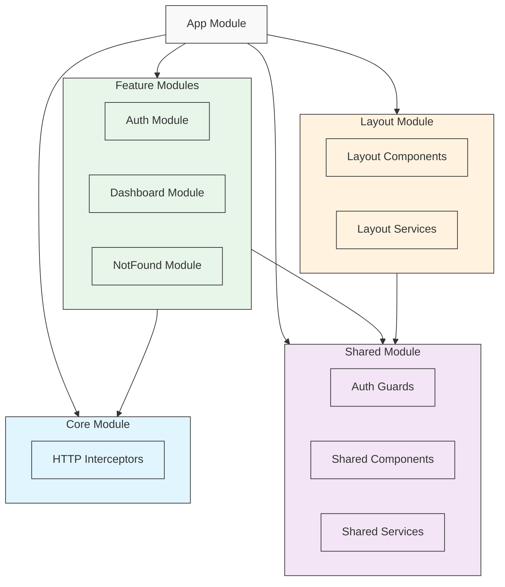

# Análisis Arquitectónico del Proyecto

## Tecnologías Utilizadas

### Core
- **Angular**: Versión 20 (Framework principal)
- **TypeScript**: Versión ~5.8.3
- **RxJS**: Versión ~7.8.2 (Programación reactiva)

### UI/UX
- **PrimeNG**: Versión 20 (Biblioteca de componentes UI)
- **PrimeIcons**: Versión 7.0.0 (Iconografía)
- **Chart.js**: Versión 4.4.2 (Visualización de datos)
- **TailwindCSS**: Versión 4.1.11 (Framework CSS utilitario)

### Herramientas de Desarrollo
- **ESLint**: Versión 9.30.1 (Linting)
- **Prettier**: Versión 3.6.2 (Formateo de código)
- **Karma/Jasmine**: Testing framework

## Estructura del Proyecto

La aplicación sigue una arquitectura modular basada en características (Feature-based Architecture) con una clara separación de responsabilidades.

### Estructura de Carpetas

```
src/
├── app/
│   ├── core/              # Funcionalidad central y servicios singleton
│   │   └── interceptors/  # Interceptores HTTP
│   ├── features/          # Módulos de características
│   │   ├── auth/         # Módulo de autenticación
│   │   ├── dashboard/    # Módulo de dashboard
│   │   └── notfound/     # Módulo de página no encontrada
│   ├── layout/           # Componentes de diseño y estructura
│   │   ├── component/    # Componentes de layout
│   │   └── service/      # Servicios relacionados con el layout
│   └── shared/           # Recursos compartidos
│       └── guards/       # Guards de autenticación
├── assets/               # Recursos estáticos
│   ├── styles.scss      # Estilos globales
│   ├── tailwind.css     # Configuración de Tailwind
│   ├── demo/            # Recursos de demostración
│   └── layout/          # Estilos específicos del layout
└── environments/        # Configuraciones por entorno
```

## Diagrama de Arquitectura



## Patrones Arquitectónicos

1. **Arquitectura Modular**: La aplicación está dividida en módulos funcionales que encapsulan características específicas.

2. **Core Module**: Contiene servicios singleton y funcionalidades que se cargan una única vez.

3. **Feature Modules**: Módulos independientes que implementan características específicas del negocio.

4. **Shared Module**: Contiene componentes, directivas y servicios reutilizables.

5. **Layout Module**: Gestiona la estructura y diseño general de la aplicación.

## Seguridad

- Implementación de guards para protección de rutas
- Interceptores HTTP para manejo de autenticación
- Sistema de autenticación centralizado

## Estilo y UI

- Utilización de TailwindCSS para estilos utilitarios
- Componentes PrimeNG para UI consistente
- Sistema de temas claro/oscuro
- Diseño responsivo

## Buenas Prácticas Implementadas

1. **Separación de Responsabilidades**: Clara división entre módulos y componentes
2. **Lazy Loading**: Estructura preparada para carga perezosa de módulos
3. **Interceptores**: Manejo centralizado de peticiones HTTP
4. **Guards**: Protección de rutas y autenticación
5. **Servicios**: Patrón singleton para servicios globales
